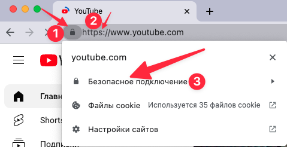
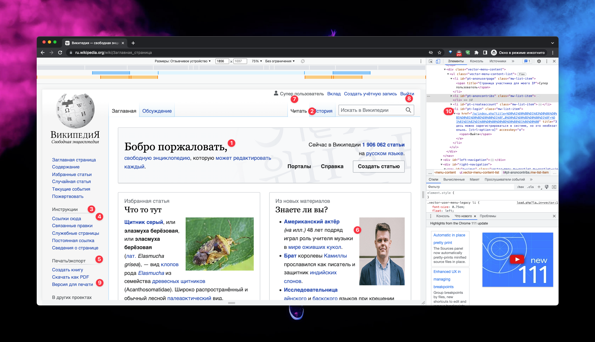
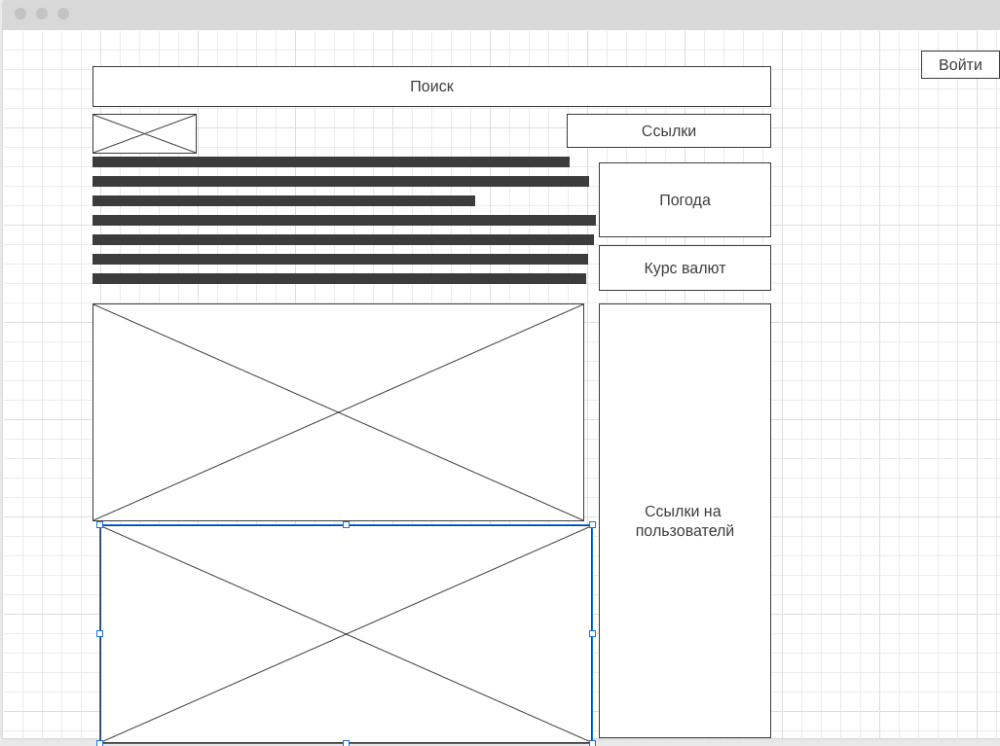

# Домашнее задание
### Структура документа:
1. Описание домашнего задания
2. Выполненное домашнее задание

# 

Формат сдачи ДЗ - один архив, со всеми файлами и скриншотами, либо ссылка на github.

1. Определите, на каком протоколе работает сайт youtube.com.
Сделайте скриншот с названием 1_protocol.jpg, по которому станет понятно, как вы определили протокол сайта. Можно описать словами.

2. Создайте файл 2_analyze.txt, в котором проанализируйте структуру страницы сайта https://ru.wikipedia.org/, а именно нужно описать (коротко, своими словами), какие блоки есть на сайте, что в этих блоках находится. Есть ли на сайте шапка, подвал, что в них содержится? Как и где расположен контент? Есть ли дополнительные элементы на странице?\
Представьте, что вы описываете сайт дизайнеру или разработчику и пытаетесь объяснить на словах, из чего будет состоять сайт, какие в нем будут основные блоки. Нас не должны интересовать теги или классы в html, какие-либо мелкие детали сайта, все это детали реализации, которые будут приниматься программистом и дизайнером. Интересует то, как вы опишите словами сайт, чтобы разработчик и дизайнер поняли, с чем им предстоит работать.

3. Внесите не менее 10 изменений на страницу любой статьи сайта https://ru.wikipedia.org/, с помощью инструмента разработчика и представьте два скриншота было/стало (скриншоты должны иметь названия 3_before.jpg, 3_after.jpg соответственно), а также краткие пояснения что и где было изменено. Желательно поработать с изменением текста на странице, заменой картинки, изменением стилей и видом иконок.

4. Создайте прототип низкой детализации сайта https://dzen.ru/ с помощью сайта https://wireframe.cc/. Предоставьте скриншот того, что получилось (скриншот должен быть назван 4_proto.jpg).

## Домашнее задание: 

1.  Протокол работы youtube.com

2. Структура страницы ru.wikipedia.org

[Файл домашнего задания 2_analyze.txt](2_analyze.txt)

3. Внести 10 изменений на страницу ru.wikipedia.org

[before](3_before.jpg) |  [after](3_after.jpg)

4. Создайте прототип низкой детализации dzen.ru 

